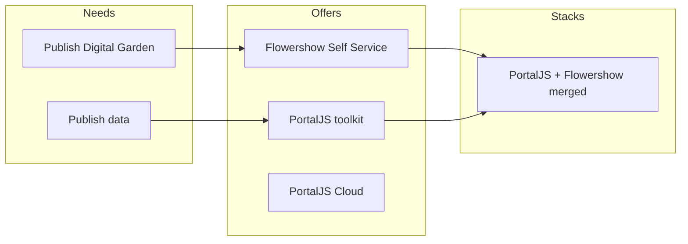

We have a common stack (Flowershow/PortalJS) build around Markdown Plus / data rich documents that can power multiple use cases. The audiences, to their own minds at least, have very distinct needs. So the discussion here was about identifying the audience and the pitch to them.

The idea was that the same stack and even same cloud application ("Flowershow Cloud") with small adaptations could supply each of the use cases

For background see the second half of hangout recording of Rufus and Ola on 2023-11-06 in afternoon https://drive.google.com/file/d/1s2H7y0BWODowZaB1u-SlkLR7MYe_xwwv/view

## List of use cases

- DataRich.dev: Build polished data-driven stories and reports with markdown and SQL.
  - Audience: data scientists and data analysts
  - Pain point:
  - Value proposition:
- Flowershow: publish your digital garden elegantly with ease
  - Audience: digital gardeners (who use markdown)
- Markdown.ed: turn markdown into a website in 30s
  - Audience: People who want to control their content ... and don't want to have build/manage their publish platform
    - Busy geeks
- DataPublish.dev: a simple pattern (and toolchain) for publishing simple documented datasets
  - Put your dataset in github / r2
  - "Documented Datasets - README + CSV"
- DataBin: paste and share data quickly and easily
  - Upload a CSV file and off you go.

# Appendix: June 2023 Reflections on our audiences and offers especially broader re Flowershow etc (June 6 2023)

## Audiences

- Digital gardeners: publish your digital garden online
  - Self-service: Obsidian plugin + github template
  - Hosted: Flowershow Cloud offering
- Dataset curators/manager: publish/share your datasets online
  - Custom: PortalJS Toolkit
  - Self-service: clone this template and tweak
  - Cloud: PortalJS cloud
- (Non-tech) JAMStack Website builders (people who used wordpress but could use jekyll/flowershow/11ty if it was easier): ... e.g.  LifeItself.org
  - Custom: 
  - Self-service
  - Cloud ...

## Questions

- [ ] Where do these offers get published?
  - [ ] What are the options?](https://dash.cloudflare.com/83025b28472d6aa2bf5ae59f3724aa78/r2/default/buckets/datahub-assets/objects/config.json/details)

# Comments from David Gasquez

*2023-11-08*

Hey! Expanding my per-use case thoughts a bit more.

## DataRich.dev

- As mentioned in the previous comment, I think this requires a tight feedback loop and am not sure how close Portal.js is to that experience. In my mind, it needs an easy way to transform data and quickly explore multiple visualizations.
- Would be great to work towards an standard? Both Quarto and Evidence.dev are already moving on their own direction, which makes sense. Wondering if there is a way to reuse Evidence.dev style component definitions with Quarto Markdon language cells, [cross references](https://quarto.org/docs/authoring/cross-references.html) and [citations](https://quarto.org/docs/authoring/footnotes-and-citations.html).  

## Flowershow

- Even though there are many open source [Obsidian Publish alternatives](https://www.ssp.sh/brain/open-source-obsidian-publish-alternatives/), there isn't many aiming for the _smoothness_ of Flowershow. 
- The market might be small as Obsidian users will either rely on their publish feature or use on the free alternative to have more control (e.g: publishing Quartz output to Cloudflare Pages).

## Markdown.ed

- I don't know of any website that does this but seems a nice and simple product. Upload a bunch of Markdown files get your `user.markdown.ed` web? In the past I've used [Bear Blog](https://bearblog.dev/) and enjoyed the simplicity.

## DataPublish.dev

- This is the option that resonates the most with me. A simple website where I can upload a file and get an endpoint and website from it.
- Initially, it could be as simple as that although I can see multiple ways it could add more value:
  - Store the asset in multiple backends (R2, S3, GitHub Releases, ...)
  - Automatically generates a `datapackage.yaml` from README and data.
  - Related datasets...
  - API Endpoints to add/update datasets
  - GitHub actions to add/update datasets
  - Extra endpoints to explore the data. E.g: `datapublish.dev/user/dataset/explore` pointing to a flatfile table or a [datasette little instance](https://lite.datasette.io/).
- Would be great how can this be surfaced in other places.
  - Perhaps something like a GitHub Badge for `datapublish.dev`? 
- Could `datapublish.dev` be backed on GitHub? 
  - Create a repo for each dataset. 
  - Keep the repo's README up to date with static charts (static version of the website).
  - Sync issues and discussions on github. 
  - I view this similar to how I view Cloudflare Pages or Netlify. You can interact with it without GitHub/git, but it is there and can be surfaced. I need to improve the analogy and think further on this path as is something I feel strongly about but not very clear why.
- To recap, the user flow I have in mind is something like: 
  1. Upload a dataset
  2. Write a small readme. Can use Portal.js stuff.
  3. Click publish and get a few links: one to the dataset (`datapublish.dev/user/dataset.csv`) and another to the rendered readme (`datapublish.dev/user/dataset`).
  4. All the other things are optional and can be done in the future.
- I'll write a follow up with the architecture this project could use!

## DataBin

- This might be a subset of DataPublish.dev, right? Upload a file and get an url.
- The only thing that comes to mind is that if the service is open, it'll be heavily abused.

Happy to expand on these and continue exploring how these options might work!